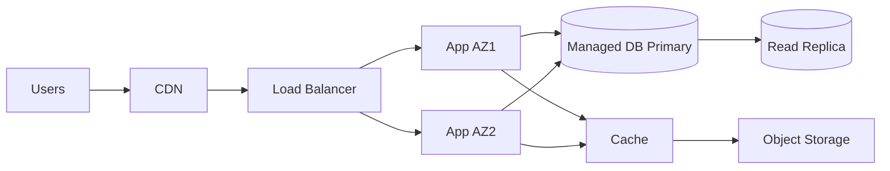

---
# Case Studies & Examples

tags: [Cloud, Case Studies]
---

## 1. Simple Static Site + CDN
| Aspect | Choice | Rationale |
|--------|-------|-----------|
| Hosting | Object storage static web | Low ops, durability |
| Distribution | CDN | Latency reduction, edge caching |
| TLS | Managed cert | Automatic renewal |
| Logs | CDN + bucket access logs | Cache tuning, security review |
| Deployment | CI pipeline sync | Immutable versioned releases |
**Lessons:** Start serverless to avoid premature complexity.

## 2. Multi‑AZ Web Application

| Concern | Mitigation |
|---------|-----------|
| Single AZ outage | Active replicas in 2 AZs |
| Read load spikes | Cache + read replica |
| Deployment risk | Rolling / blue-green strategy |
| Secrets handling | Managed secrets store |
**Lessons:** Cross‑AZ design + cache minimize latency and failover impact.

## 3. Event‑Driven Data Processing
| Component | Role |
|----------|-----|
| Ingestion Queue | Buffer bursty events |
| Serverless Functions | Stateless transform & enrichment |
| Object Storage | Durable raw + processed layers |
| Stream / Analytics Service | Real‑time aggregation |
| Catalog / Metadata | Data discovery & lineage |
**Lessons:** Decouple producers/consumers; pay only per execution.

## 4. Startup SaaS Growth Phases
| Phase | Architecture Shift | Trigger |
|-------|-------------------|--------|
| MVP | Single region, managed DB | Validate product |
| Growth | Multi‑AZ, add cache & queue | Latency & throughput pressure |
| Scale | Multi‑region read replicas, sharding | Global users, failover RTO |
| Optimization | Cost governance, reserved capacity | Spend > threshold |
**Lessons:** Introduce complexity only when metrics justify.

## 5. Post‑Incident Improvement Loop
1. Detect (alert on SLO burn).
2. Triage (establish blast radius).
3. Mitigate (failover / scale adjustment).
4. Post‑mortem (blameless, timeline, contributing factors).
5. Action Items (rank by risk reduction / cost / effort).
**Lessons:** Institutionalize learning to raise baseline resilience.

## 6. Pattern Mapping
| Need | Pattern |
|------|--------|
| Throughput scaling | Event queues + workers |
| Availability | Multi‑AZ active/active |
| Cost reduction | Serverless for intermittent load |
| Latency | CDN + edge compute |
| Data durability | Versioned object storage |

## 7. Next
Return to [Overview](overview.md) or explore preceding sections.
