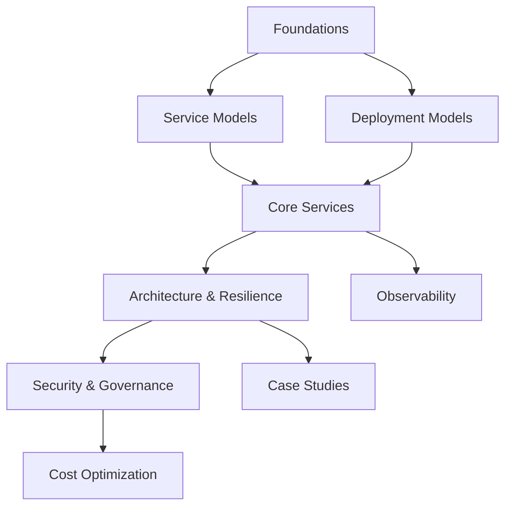

# Cloud Computing: Overview & Course Guide

A structured, vendor‑neutral foundation for understanding how modern cloud platforms deliver compute, storage, networking and higher‑level managed services. This guide sets expectations, maps the learning path, and links concepts to practical engineering scenarios.

---
## 1. Objectives & Outcomes
By the end you should be able to:
- Explain core characteristics (on‑demand self‑service, elasticity, measured service, resource pooling, broad network access)
- Differentiate service models (IaaS / PaaS / SaaS / FaaS) and when to use each
- Compare deployment models (Public, Private, Hybrid, Multi‑Cloud, Edge)
- Describe virtualization, containerization and serverless execution models
- Identify primary building blocks: compute, storage types, networking primitives, identity & access, observability, security
- Design a simple highly available, cost‑aware reference architecture across multiple availability zones
- Interpret pricing levers & optimize cost (right‑sizing, elasticity, lifecycle policies)
- Recognize shared responsibility boundaries for security and compliance

---
## 2. High-Level Structure (Modules)
| Module | Focus | Key Questions |
|--------|-------|---------------|
| 0. Foundations | Why cloud, characteristics | What problems does cloud solve vs on‑prem? |
| 1. Service Models | IaaS / PaaS / SaaS / FaaS | Which abstraction fits my use case? |
| 2. Deployment Models | Public / Private / Hybrid / Multi / Edge | How do I balance control & agility? |
| 3. Virtualization & Containers | Hypervisors, containers, orchestration | Why containers over VMs? |
| 4. Core Services | Compute, storage, network, identity | What are the primitives I assemble? |
| 5. Architecture & Resilience | HA, scalability, elasticity, DR | How do I design for failure? |
| 6. Security & Governance | IAM, encryption, policies, compliance | Who secures what? |
| 7. Cost & FinOps | Pricing models, optimization | How do I avoid waste? |
| 8. Observability | Metrics, logs, tracing | How do I know it works in production? |
| 9. Case Studies | Real usage patterns | How do concepts appear in practice? |

---
## 3. Conceptual Map

---
## 4. Prerequisites
- Basic OS & networking fundamentals (IP, DNS, routing, latency vs throughput)
- Comfort with command line & version control (Git)
- Introductory scripting (Bash or Python) helpful for automation examples

---
## 5. Detailed Syllabus & Reading Path
### Module 0 – Foundations
- Evolution: Physical → Virtualization → Cloud → Serverless & Edge
- Essential characteristics (NIST definition) unpacked with examples
- Shared Responsibility Model (baseline diagram)

### Module 1 – Service Models
- IaaS vs PaaS vs SaaS vs FaaS vs Managed Services
- Trade‑off triangle: Control vs Velocity vs Operational Burden
- Migration considerations (Lift & Shift → Re‑platform → Re‑architect)

### Module 2 – Deployment Models
- Public cloud advantages & risks
- Hybrid connectivity patterns (VPN, Direct Connect / ExpressRoute equivalents)
- Multi‑cloud drivers (compliance, latency, risk) & complexity costs

### Module 3 – Virtualization & Containers
- Hypervisors (Type 1 vs Type 2) simplified
- Containers & image layering; orchestration essentials (scheduling, service discovery, scaling)
- When serverless (FaaS) makes sense vs containers (event‑driven, bursty workloads)

### Module 4 – Core Services
- Compute: VMs, autoscaling groups, container services, FaaS
- Storage Spectrum: Object (durability + scale) / Block (low latency) / File (shared POSIX) / Ephemeral
- Networking: VPC, subnets (public/private), routing tables, gateways, security groups / ACLs, load balancing, CDN
- Identity & Access: Principles of IAM (least privilege, role separation)
- Data Services (relational, NoSQL, cache) – conceptual coverage only

### Module 5 – Architecture & Resilience
- High availability across AZs
- Scalability patterns (horizontal vs vertical vs diagonal)
- Elasticity triggers (metrics, queue depth, SLO burn)
- Fault isolation & blast radius reduction
- Disaster Recovery tiers (Backup/Restore → Pilot Light → Warm Standby → Active/Active)

### Module 6 – Security & Governance
- Identity layers (users, roles, temporary credentials)
- Encryption (at rest: KMS; in transit: TLS)
- Network segmentation & zero trust basics
- Policy enforcement: tagging standards, guardrails, IaC scanning

### Module 7 – Cost & FinOps
- Pricing primitives: compute hours, storage GB-month, data egress, API requests
- Cost awareness design (stateless = scale to zero, lifecycle policies, reserved vs spot capacity)
- KPIs: Cost per feature/user, waste %, coverage of tagging, idle resources

### Module 8 – Observability
- Golden signals (latency, traffic, errors, saturation)
- Logs vs Metrics vs Traces synergy
- Health checks & synthetic probes

### Module 9 – Case Studies
- Student project: Static site + CDN + object storage
- Startup SaaS: Multi‑AZ web tier + managed database + queue + cache
- Data Processing: Event ingestion + serverless functions + object storage + analytics service

---
## 6. Learning Approach
| Practice | Why |
|---------|-----|
| Incremental reading | Avoid overload; reinforce retention |
| Diagramming | Reveals hidden dependencies |
| Hands‑on mini labs | Convert theory to muscle memory |
| Compare providers | Distill vendor‑neutral principles |
| Teach back / summarize | Deepens understanding |

---
## 7. Study Plan (Example 4 Weeks)
| Week | Focus | Deliverable |
|------|-------|------------|
| 1 | Foundations + Service & Deployment Models | Summary diagram & glossary draft |
| 2 | Virtualization + Core Services | Mini reference sheet (compute/storage/network) |
| 3 | Resilience + Security + Cost | HA architecture sketch & cost levers list |
| 4 | Observability + Case Studies | End‑to‑end design + post‑mortem simulation |

---
## 8. Glossary Sampler
| Term | Short Definition |
|------|------------------|
| Region | Geographical cluster of data centers |
| Availability Zone | Isolated fault domain inside a region |
| Elasticity | Automatic scale up/down with load |
| Object Storage | Flat namespace storage with high durability |
| Autoscaling | Policy-driven adjustment of compute units |

(Full glossary planned in dedicated reference.)

---
## 9. Tooling Examples (Generalized)
| Need | Typical Option |
|------|----------------|
| Provision infrastructure | IaC (Terraform, Pulumi) |
| Container orchestration | Managed Kubernetes service |
| Workload decoupling | Message queue or event bus |
| Caching | In‑memory key/value store |
| Observability pipeline | Metrics + logs + tracing stack |

---
## 10. Real‑World Alignment
Each module maps to real decisions: choosing service model impacts operational burden; network segmentation influences lateral movement risk; storage class selection affects performance & cost; resilience tier sets RTO/RPO commitments.

---
## 11. Assessment Ideas (Optional Self‑Check)
- Explain difference between scalability and elasticity with an example
- Draw a 3‑tier web architecture across two AZs
- Identify three cost optimization levers for a bursty workload
- Outline least privilege IAM approach for a deployment pipeline

---
## 12. Next Steps
Proceed to: [Service Models](service-models.md) → [Deployment Models](deployment-models.md) → [Key Concepts](key-concepts.md)

> Continuous refinement: sections will gain deeper diagrams, comparative provider notes, and lab exercises over time.
