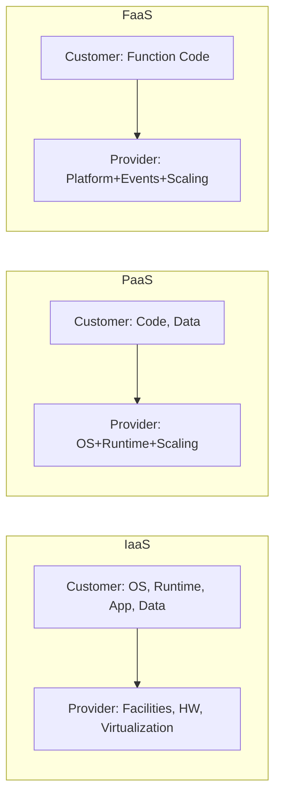

---
# Service Models (IaaS / PaaS / SaaS / FaaS / Managed)

tags: [Cloud, Foundations]
---

## 1. Purpose
Clarify abstraction layers, operational ownership boundaries, and selection criteria when designing or modernizing workloads.

## 2. Quick Definitions
| Model | Primary Consumption Unit | You Focus On | Provider Handles | Core Benefit | Key Trade‑Off |
|-------|--------------------------|--------------|------------------|--------------|--------------|
| IaaS | VM / network / volume | OS hardening, patching, runtime, scaling logic | Physical DC, hypervisor, base HW | Maximum flexibility | Highest operational overhead |
| PaaS | Application/runtime deploy (buildpack / container) | Code & data shape | OS, runtime stack, autoscaling framework | Faster delivery | Less low‑level control |
| FaaS (Serverless) | Function invocation | Stateless code, event binding, logic | Infra, scaling to zero, concurrency mgmt | Cost efficiency for spiky events | Cold starts, execution limits |
| SaaS | Feature/API usage | Configuration & adoption | Entire stack | Speed & minimal ops | Vendor constraints & data placement |
| Managed Service (DB, MQ, Cache) | Service endpoint | Schema / topics / tuning | Patching, HA, backups | Reduced toil, built‑in resilience | Configuration ceilings, cost premium |

## 3. Shared Responsibility (Layer View)


## 4. Decision Drivers
| Driver | Lean Toward | Rationale |
|--------|-------------|-----------|
| Need fine‑grained kernel tunings | IaaS | Full OS access |
| Fast prototype / low ops headcount | PaaS / FaaS | Abstract infra complexity |
| Highly variable traffic, low baseline | FaaS | Scale to zero reduces idle cost |
| Vendor feature velocity > internal capability | SaaS / Managed | Leverage external innovation |
| Complex stateful workload w/ custom clustering | IaaS / Managed Mix | Combine bespoke logic + managed primitives |

## 5. Control vs Velocity Triangle
> The more abstraction you adopt, the more velocity you gain at the cost of raw control & potential portability.

```
(Control) IaaS —— PaaS —— FaaS/SaaS (Velocity)
```

## 6. Migration Patterns
| Stage | Description | Example |
|-------|-------------|---------|
| Lift & Shift | Minimal change VM move | On‑prem app → Cloud VM |
| Re‑platform | Adopt managed middleware | Self‑hosted DB → Managed DB |
| Re‑factor | Redesign into services/functions | Monolith → Functions + Queue |
| Re‑architect | Domain‑driven redesign w/ event backbone | Batch ETL → Streaming + Serverless |

## 7. Cost & Operational Implications
- IaaS: You absorb patch cycles, scaling config, incident toil.
- PaaS: Reduced patch toil; watch for opinionated buildpack constraints.
- FaaS: Pay per ms / request; watch for unbounded concurrency cost & cold start latency.
- SaaS: Opex predictable (subscription); risk of vendor lock & data export complexity.
- Managed: Hidden ops reduced but still need capacity governance & cost guardrails.

## 8. Anti‑Patterns
| Anti‑Pattern | Why It Hurts | Better Approach |
|--------------|-------------|-----------------|
| Forcing FaaS for long‑running batch | Execution timeouts, cost blow‑up | Use containers / batch service |
| DIY database on raw VMs | Patching & HA toil | Managed relational/NoSQL service |
| Overusing SaaS w/o data classification | Data sprawl, compliance risk | Data tiering & governance policy |

## 9. Quick Selection Checklist
- Peak vs baseline traffic ratio > 10×? Consider FaaS for event slice.
- Team SRE bandwidth low? Bias toward Managed/PaaS.
- Heavy compliance / latency locality? Validate SaaS region + residency.
- Need custom networking or exotic drivers? Stay IaaS (initially).

## 10. Next
Continue with [Deployment Models](deployment-models.md) or return to [Overview](overview.md).
