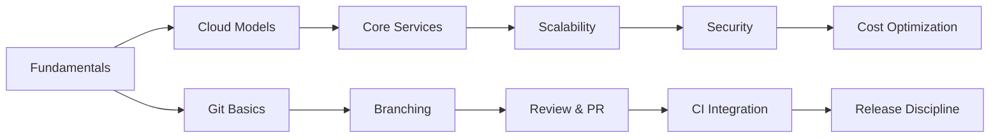

# Codesavoir Knowledge Base

!!! abstract "Purpose"
    Curated, evolving repository of practical DevOps & IT engineering knowledge.

-   :material-cloud-outline: **Cloud Computing**  
    _Foundations, models, architecture, cost, security._  
    [:material-arrow-right-circle: Explore](cloud-computing/overview.md)

-   :material-source-branch: **Git Flow**  
    _Branching, commits, review, releases._  
    [:material-arrow-right-circle: Explore](git-flow/overview.md)

-   :material-compass-outline: **Roadmap**  
    _Upcoming domains: IaC, CI/CD, Observability, Security, Playbooks._

## Architecture Scope (Mermaid Map)

## Content Types
| Type | Purpose |
|------|---------|
| Foundations | Core concepts & mental models |
| How-To Guides | Implementation patterns |
| Playbooks (future) | Fast incident / ops response |
| Reference (future) | Command & config lookups |
| Patterns & Anti-Patterns | What to repeat / avoid |
| Cheat Sheets | Rapid revision & onboarding |

## Quality Principles
:material-check-all: Clarity over jargon  
:material-check-all: Reproducible examples  
:material-check-all: Vendor-neutral first  
:material-check-all: Explicit assumptions  
:material-check-all: Version awareness  

## Roadmap Highlights
> IaC · CI/CD Patterns · Observability & SRE · Secure Delivery · Operational Playbooks

!!! note "Contribution"
    Contribution workflow & style automation planned. Feedback loops will guide prioritization.

> Continuous iteration over large infrequent drops.
