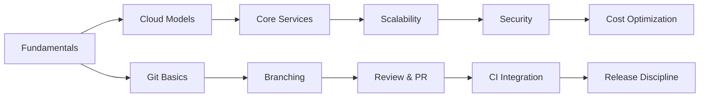

# Codesavoir Knowledge Base

!!! abstract "Purpose"
    Curated, evolving repository of practical DevOps & IT engineering knowledge.

-   :cloud: **Cloud Computing**  
    _Foundations, models, architecture, cost, security._  
    [:arrow_right: Explore](cloud-computing/overview.md)

-   :twisted_rightwards_arrows: **Git Flow**  
    _Branching, commits, review, releases._  
    [:arrow_right: Explore](git-flow/overview.md)

-   :compass: **Roadmap**  
    _Upcoming domains: IaC, CI/CD, Observability, Security, Playbooks._

## Architecture Scope (Diagram)

!!! note "Diagram Rendering"
    If the diagram does not appear, ensure JavaScript is enabled and the Mermaid custom fence is configured.

## Content Types
| Type | Purpose |
|------|---------|
| Foundations | Core concepts & mental models |
| How-To Guides | Implementation patterns |
| Playbooks (future) | Fast incident / ops response |
| Reference (future) | Command & config lookups |
| Patterns & Anti-Patterns | What to repeat / avoid |
| Cheat Sheets | Rapid revision & onboarding |

## Quality Principles
- Clarity over jargon
- Reproducible examples
- Vendor-neutral first
- Explicit assumptions
- Version awareness

## Roadmap Highlights
> IaC · CI/CD Patterns · Observability & SRE · Secure Delivery · Operational Playbooks

!!! note "Contribution"
    Contribution workflow & style automation planned. Feedback loops will guide prioritization.

> Continuous iteration over large infrequent drops.
